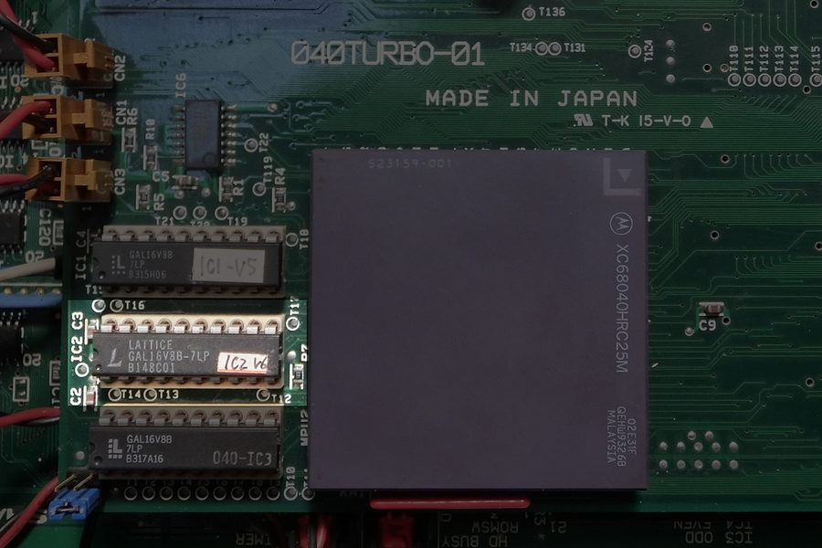

# 040GAL.LZH
This is the GAL data for 040turbo, a 68040 accelerator for X68030 developed by BEEPs.
This GAL data fixes one bug that was discovered after the publication of "The So-Called 040turbo Book".

## Only GAL IC2 (GAL16V8) is affected by this fix.

## Contents of the fix
In multiple processes where the BERR signal is input, due to differences in the signal assertion timing and GAL chip,
one of the logics does not recognize it as a bus error, causing a discrepancy, and the 68040 hangs up.
When this happens, NMI does not work and the only option is to reset.

In this fix, the BERR signal is changed to be recognized collectively before being passed to each process.
For details of the fix, please compare it with IC2_V5.PLD attached for reference.

One method to check for this issue is to make spurious interrupts, a type of bus error, occur frequently.
This issue was discovered by *mfptest*, which intentionally makes spurious interrupts occur frequently.

## Is it okay if I don't rewrite it?
At the time, there were differences in the GAL lots in terms of whether they caused problems (or were less likely to cause problems?).
If you don't get a hang-up with *mfptest* even with old GAL data before the countermeasures were implemented, there is no need to rush to rewrite it, but
it is unknown what will happen depending on the operating environment or the passage of time, so keep this in the back of your mind.
This may improve your environment if you are experiencing mysterious hang-ups when playing music data that includes ADPCM.

## Upload header at the time
======================================================================

Name: Complete set of GAL data used in 040turbo

Registered name: 040GAL.LZH

Date: 94/09/19 23:50:12

Original author: BEEPs (PEG00631)

Creator: BEEPs (PEG00631)

Poster: BEEPs (PEG00631)

Copyright: Abandoned

Expansion method: ISH 040GAL.ISH || LHA x 040GAL.LZH
{Reproduction} No restrictions
= ... IC1_V5 PLD 2991 94-09-19 23:46:58 IC2_V6 PLD 2039 94-09-19 23:46:58 IC3 PLD 2549 94-09-19 23:46:58 IC4_V3 PLD 2773 94-09-19 23:46:58 IC5 PLD 2 095 94-09-19 23:46:58 IC1_V5 JED 1446 94-09-19 23:46:58 IC2_V6 JED 1488 94-09-19 23:46:58 IC3 JED 1568 94-09-19 23:46:58 IC4_V3 JED 2623 94-09-19 23:46:58

IC5 JED 1694 94-09-19 23:46:58

---------------------------------------------------------
040turbo information is free. Reprinting, secondary use, and other uses are free.
---------------------------------------------------------------------

#### Digression
We have not been able to confirm any hang-ups with the slower versions (15 and 25) and the Atmel ATF16V8B-15 when using old GAL data (V5).

At that time, it seemed like the Lattice logo, which consisted of ***6 squares and an L***, was more likely to be produced in relatively new batches...
